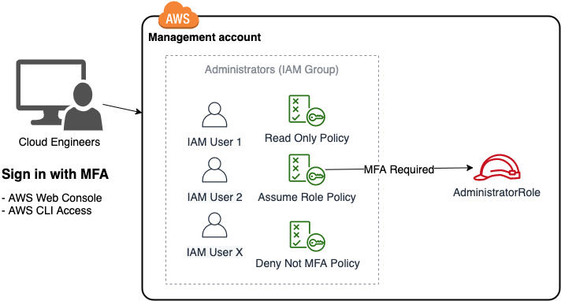

## Background
Always protect your personal AWS IAM users with Multi-Factor Authentication (MFA). It comes with a small additional burden to type six numbers each time you log in to the AWS Console. But if you ignore the risk to not enable MFA, you will regret the day your username and password are leaked. And even worse, the day your long term access keys are leaked.  

## Purpose
This tiny python script bundle will support you enable MFA on your user and the usage of its long term access keys. Each day you need to escalate your IAM user privileges. This tool enable you to assume, by you defined, an IAM Role with the additional step to type in your MFA token. Default expiration of these short term keys are 12 hours.


## Start use AWS MFA Token! 

Clone this repo.  

Navigate to project root dir and install python requirements:
```
pip install -r requirements.txt
```

[Create your AWS IAM Access keys][1] and configure AWS CLI as described below.   

Modify $HOME\\.aws\config with profile default:
```
[profile default]
region = eu-west-1
output = json
```

Modify $HOME\\.aws\credentials with: 
```
[my-longterm-credentials]
aws_access_key_id = ACCCCCCCCCCCESS-KEY-ID
aws_secret_access_key = SEEEEEEEEEEEEEEEEEEEEEEECRET-ACCESS-KEY
username = my_iam_user_name
```

For usage of awstoken.py run:
```
python python_files/src/awstoken.py --help 
```

Typical usage:
```
python python_files/src/awstoken.py --role-name AdministratorRole --long-term-cred-profile my-longterm-credentials --account-id 123456789098
```

### AWS Organization support
When having the IAM user in the AWS Organization Management account, you can omit the ```--account-id``` parameter. Then you will be prompted by a list of all the AWS accounts that is present in the AWS Organization.

## Tip
For MAC users you preferably create an alias for common used config.  

Add to ~/.zshrc
```
alias aws-token-audit="python /Users/your_path_to_repo/aws-mfa-token/python_files/src/awstoken.py --role-name AdministratorRole --long-term-cred-profile my-longterm-credentials --account-id 123456789098"

```

## DEMO

<iframe width="560" height="315" src="https://www.youtube.com/embed/t0WxnQnxWF4" title="YouTube video player" frameborder="0" allow="accelerometer; autoplay; clipboard-write; encrypted-media; gyroscope; picture-in-picture" allowfullscreen></iframe>

[1]: https://docs.aws.amazon.com/IAM/latest/UserGuide/id_credentials_access-keys.html#Using_CreateAccessKey